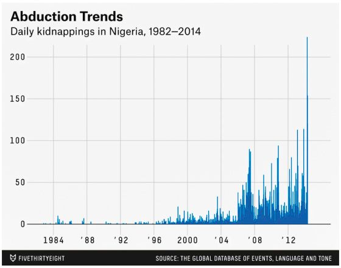
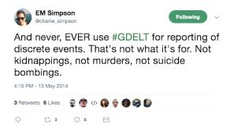
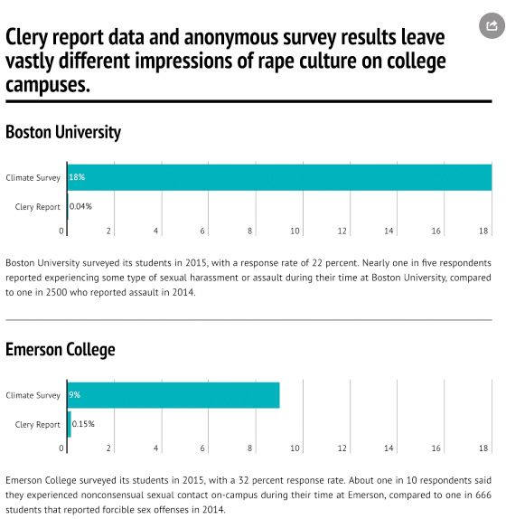
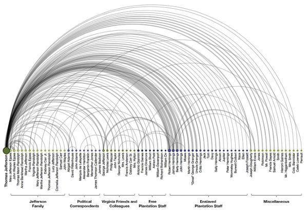

```{r setup, include=FALSE}
options(htmltools.dir.version = FALSE)
knitr::opts_chunk$set(
  echo = FALSE,
  fig.align = "center",
  message = FALSE,
  warning = FALSE
)
```

```{r xaringan-themer, include=FALSE, warning=FALSE}
library(xaringanthemer)
pink <- "#fa448c"
yellow <- "#fec859"
green <- "#43b5a0"
purple <- "#491d88"
black <- "#331a38"

extra_css <- list(
  ".title-slide h1" = list(
    "color" = "#FFFFFF",
    "font-size" = "4rem",
    "background-color" = "#000000"
  ),
  ".title-slide h2" = list(
    "color" = "#FFFFFF" ,
    "background-color" = "#000000",
    "display" = "inline",
    "padding" = "15px",
    "margin" = "15",
    "font-size" = "2rem"
  ),
  ".title-slide h3" = list(
    "color" = "#FFFFFF",
    "background-color" = "#000000",
    "display" = "inline",
    "padding" = "5px",
    "font-size" = "2rem"
  )
)

style_duo_accent(
  primary_color = yellow,
  secondary_color = green, 
  white_color = pink,
  inverse_header_color = purple,
  text_font_size = "1.2rem",
  # text_bold_color = "#ff499e",
  # link_color = "#bf4392",
  # header_h1_font_size = "3rem",
  # header_h2_font_size = "1.5rem", 
  # header_color = "#944db3",
  # title_slide_text_color = "white",
  # code_inline_color = "#d008bf", 
  # text_slide_number_color = "#7c807f",
  header_font_google = google_font("Play", "400"),
  text_font_google   = google_font("Titillium Web", "400"),
  code_font_google   = google_font("IBM Plex Mono"),
  extra_css = extra_css
)
```


name: hola
class: title-slide, middle, center
background-image: url("img/cover.png")

# `r rmarkdown::metadata$title`

## `r rmarkdown::metadata$author`

<br></br>
### `r rmarkdown::metadata$institute`

---
class: inverse, middle

# Principio: ***Considera el contexto***

--

El feminismo de datos afirma que **los datos no son neutrales ni objetivos**. Son el producto de relaciones sociales desiguales y este contexto es esencial para realizar un análisis ético preciso.

---
class: inverse, middle

# Concepto clave 1: ***Big Dick Data***

Es un término académico formal acuñado por las autoras para denotar proyectos de big data que se caracterizan por **fantasías** patriarquiales, cis-masculinistas y totalizadoras de dominación mundial que se llevan a cabo a través de la captura y el análisis de datos. Los proyectos de Big Dick Data **ignoran el contexto**, **fetichizan el tamaño** e **inflan sus capacidades técnicas y científicas.**

---
class: middle


# Ejemplo: ***FiveThirtyEight***

--

- Secuestro de 276 mujeres jóvenes desde un colegio en Nigeria en abril del 2014.

--

- Creciente demanda en todo el mundo por exigir su liberación y el actuar del gobierno.

```{r,  fig.show = "hold", out.width = "50%", fig.align = "default"}


```

---
class: middle

- FiveThirtyEight publica en su blog un artículo basado en datos denominado "El secuestro de niñas en Nigeria es parte de un problema que empeora" acompañado de gráficos y mapas que dan cuenta de dicha realidad. 

--

- Los datos fueron obtenidos desde Global Database of Events, Language and Tone (GDELT). Una base de datos abiertos que recopila eventos desde publicaciones en la prensa.

--

```{r, out.width = "45%", fig.align = "center"}

```

---
class: middle

# GDELT

--

_GDELT es “una iniciativa para construir un catálogo de comportamientos y creencias a escala social humana en todos los países del mundo, conectando a cada persona, organización, ubicación, recuento, tema, fuente de noticias y evento en todo el planeta en una única red masiva que captura lo que está sucediendo en todo el mundo, cuál es su contexto y quiénes están involucrados, y cómo se siente el mundo al respecto, todos los días "._

---
class: middle

# Pero...

- Parte del equipo de GDELT llegó a aclarar el contexto de la base de datos.

```{r,  fig.show = "hold", out.width = "50%", fig.align = "default"}


```

---
class: inverse, middle

# Lecciones:

--

- Cuidado al encontrar datos en Internet sin investigar su fuente y contexto de adquisición.

--

- Debemos tener cuidado con "el set de datos soñado".

--

- No analizar los datos desde el prejuicio.

--

- ¿Cuánta responsabilidad tiene quien disponibiliza los datos y cuánta quién los utiliza?

---
class: inverse, middle

--

# Concepto clave 2: ***Infraestructura del Conocimiento***

Lo que Christine Borgamn define como “una ecología de personas, prácticas, tecnologías, instituciones, objetos materiales y relaciones” o el contexto que hace posible los datos.

--

# Concepto clave 3: ***Datos abiertos***

La idea de que cualquier persona puede acceder, usar, modificar y compartir datos libremente para cualquier propósito.

---
class: middle

# Ejemplo: datos abiertos

--

- Muchos países y organizaciones publican datos en Internet bajo el concepto de Datos Abiertos en portales bastante sofisticados (con todo el marketing que esto conlleva).

--

- Pero, ¿se publica también información sobre el contexto de adquisición, las metodologías utilizadas, los posibles sesgos, la información faltante, etc.? En la gran mayoría de los casos la respuesta es **NO.**

--

- La realidad es que muchos conjuntos de datos publicados permanecen inactivos en sus portales, esperando que los usuarios emprendan el trabajo intensivo de descifrar su significado. Este fenómeno se ha denominado **datos zombies**: conjuntos de datos que se han publicado sin ningún propósito o caso de uso claro en mente.

---
class: middle

# Pero, ¿son tan malos los datos zombies?

- Según Chris Anderson el editor de la revista "Wired" (revista y sitio de noticias que trata de reflejar la manera en que la tecnología afecta a la cultura, a la educación, a la economía y a la política.) la respuesta es **NO**.

- El postula que **"los datos hablan por sí mismos"** y que en el contexto de "Big Data" los científicos podrían hacer análisis de una población completa sin tener que restringirse a una muestra representativa.

---
class: inverse, middle

# Concepto clave 4: ***Inferencia Estadística***

La teoría de que se puede inferir cosas sobre una población al estudiar una muestra aleatoria y/o representativa y luego mapear esos hallazgos sobre la población en su conjunto.

---
class: middle
# Siguiendo con los datos zombies

--

- Anderson postula que si logramos recolectar la información de la población completa no necesitaremos ningún tipo de modelo o prueba de hipótesis, tendremos que sólo ver los datos por sí mismos. Su mayor ejemplo es el algoritmo de búsqueda de Google.

--

- Esta es una afirmación controversial porque va en contra de la metodología de investigación y la estadística.

--

- Pero también es controversial tomando en consideración el contexto de adquisición de los datos y los sesgos con que son desarrollados los algoritmos. Por ejemplo, el algoritmo de búsqueda de Google perpetúa el racismo y el sexismo al fomentar que los usuarios entren a los sitios más populares en desmedro de aquellos con menos visitas (siempre se visita el más visitado).

---
# `r icons::fontawesome("exclamation-circle")` Ejemplo: Jeanne Cleary

--

- En abril de 1986, Jeanne Cleary fue abusada sexualmente y asesinada en su dormitorio en la Universidad de Lehigh, Estados Unidos.

--

- Tiempo después, sus padres se enteraron de que habían habido 38 crímenes violentos con anterioridad en Lehigh, información que no se había considerado de relevancia para los padres o el público general.

--

- Entonces, ellos comenzaron una campaña para mejorar la recolección de datos y mejorar los esfuerzos en contra de los crímenes violentos en campus universitarios.

--

- En la actualidad se cuenta con un set de datos que reporta todos estos eventos en todas la Universidades de los Estados Unidos (autoreportado).

--

- ¿Son las Universidades que más reportan hechos violentos las más inseguras/hostiles?

---
# `r icons::fontawesome("exclamation-circle")` ¿Qué dicen estos datos?

```{r, out.width = "45%"}

```

---
class: inverse, middle

# Lecciones:

--

- Sesgos de los datos autoreportados por instituciones.

--

- Cómo influye el contexto para que las víctimas reporten.

--

- Dejar que "los datos hablen por sí mismos" sin saber las lógicas de poder en su contexto de adquisición nos puede llevar a conclusiones erróneas y a seguir perpetuando lógicas discriminatorias y hostiles.

---

class: inverse, middle

# Concepto clave 5: ***Conocimiento Subyugado***

Este término describe las formas de conocimiento que se han expulsado de las instituciones principales y las conversaciones que fomentan. El conocimiento subyugado es el conocimiento que no se toma en serio, se descarta o se ignora, y que incluso es visto como irrelevante y sin importancia por aquellos que están posicionados para influir en lo que se considera "aceptable".

---
class: middle

# Ejemplo: Thomas Jefferson

--

- Thomas Jefferson fue el tercer presidente de los Estados Unidos de América, ocupando el cargo entre 1801 y 1809. Se le considera uno de los padres fundadores de la nación.

--
- Es conocido por ser el primer _foodie_ (founding foodie) por ser una persona aficionada a la comida lo cual dejó de manifiesto en muchas de sus cartas.

--

- Pero pocos saben que contó con personal de cocina esclavizado para preparar su famosa comida.

---
```{r, out.width="50%"}

```
En "La imagen de la ausencia" (2013), Lauren F. Klein utilizó técnicas de aprendizaje automático para identificar los nombres de las personas que Thomas Jefferson mencionó en su correspondencia personal y luego visualizó las relaciones entre ellas. El resultado demuestra todo el trabajo que su personal esclavizado puso en la preparación de las comidas de Jefferson, pero que Jefferson no reconoció directamente. Visualización de Lauren F. Klein.

---
class: middle

# Ejemplo: Lenguaje de los jóvenes

--

- Un investigador del laboratorio SAFElab en Columbia utiliza inteligencia artificial para examinar las formas en que los adolescentes de color sufren violencia tanto en línea como en su día a día.

--

- Su equipo usa datos de Twitter para entender y prevenir la violencia de bandas en Chicago. Su cantidad de datos es grande (Big Data) lo cual supone complicaciones tanto técnicas como sociales. Además, están conscientes que este tipo de investigaciones han sido mal utilizadas en contra de la población de color.

--

- Pero el investigador principal da cuenta de un problema aún más básico: ***"No sabemos cómo hablan los jóvenes"***, es necesario conocer el contexto (social, temporal, espacial, etc.) para entender los matices y el verdadero significado de una oración.

--

- No podemos pretender que el algoritmo tradicional para análisis de sentimientos sirve en todos los contextos. Entonces, debemos enseñar a hablar a nuestro algoritmo como un joven de color. ¿Quién nos puede ayudar? Los jóvenes de color.

---
class: inverse, middle

# Lecciones:

--

- Los datos NO hablan por sí mismos, no caen desde el cielo sin un contexto, estos vienen **COCINADOS**.

--

- No existen datos brutos, los datos ya vienen cocinados.

--

- No considerar el contexto permite que siga existiendo conocimiento subyugado.

--

- No considerar el contexto permite que utilicemos técnicas inadecuadas para nuestros datos y terminemos llegando a conclusiones incorrectas.

--

- Las conclusiones incorrectas afectan a personas.

---
class: inverse, middle
# Entonces ¿Qué hacer?

--
### **Comunicar el Contexto**

--

### **Restaurar el Contexto**

--

### **Considerar el Contexto**

---
# Comunicar el Contexto

--

- No presentar los datos como si fueran perfectos.

--
- Reconocer, nombrar y hablar sobre las forzantes estructurales que actúan sobre nuestros datos.

--

- No enfocarse en lo que la comunidad oprimida no tiene, sino que dar cuenta de los privilegios de los que goza un grupo específico.

--

- Importancia del lenguaje.

---
```{r, out.width="100%", fig.width=13, fig.height=6, fig.align='center'}
library(tidyverse)
library(patchwork)

salud_mental <- tibble::tribble(
            ~raza, ~total, ~diagnosticados,
        "Hispano", 20778L,           2720L,
  "Afroamericano", 18367L,           2871L,
         "Blanco",  3970L,            870L,
           "Otro",  2064L,            212L
  ) %>% 
  mutate(tasa = (diagnosticados/total)*100)

p <- ggplot(salud_mental, aes(x = reorder(raza, -tasa), y = tasa))+
  geom_col(fill = "sienna2") +
  scale_y_continuous(labels=function(x)paste0(x, "%"))+
  theme_minimal()+
  theme(axis.title = element_blank())

p1 <- p +
  labs(title = "Salud Mental en Prisión",
       subtitle = "Tasa de diagnósticos de salud mental en prisioneros",
       tag = "A")
p2 <- p +
  labs(title = "Racismo en Prisión",
       subtitle = "Las personas de color tienen menor probabilidad de un diagnóstico de salud mental",
       tag = "B")
p3 <- p +
  labs(title = "Racismo en Prisión",
       subtitle = "Las personas blancas reciben más diagnósticos de salud mental",
       tag = "C")


p1 + p2
```

---
```{r, out.width="100%", fig.width=13, fig.height=6, fig.align='center'}
p2 + p3
```

---
# Restaurar el Contexto

--

- Concepto de ***"Biografía de los datos"***

--

  - ¿De dónde provienen?
  
  - ¿Quién los recopiló?
  
  - ¿Cuándo?
  
  - ¿Cómo fueron recolectados?
  
  - ¿Por qué se recolectaron?

--

- Microsoft usa algo similar, **datasheets for datasets** (hojas de datos para set de datos) en donde además se incluye información sobre los datos perdidos, el preprocesamiento, la mantención de los datos y las implicancias legales y éticas.

---

# Considerar el Contexto

--

- Evitar que los datos hablen por sí mismos. Sobre todo cuando fueron generados bajo diferencias de poder o con incentivos negativos durante su recopilación.

--

- Entender de dónde provienen los datos y su ambiente de recolección.

--

- Considerar el contexto también en su almacenamiento. Si los datos no hablan por sí mismos en los gráficos, menos lo hacen en hojas de cálculo.

---
class: inverse
# Preguntas para discusión

- ¿Qué actores del ecosistema de datos son responsables de proporcionar el contexto? ¿Los usuarios finales? ¿Los editores de datos? ¿Los intermediarios?

- ¿Qué pasos podemos tomar para asegurar que se considere el contexto? 

- ¿Cómo podemos presentar el contexto de manera más eficaz a través de la visualización de datos?

---
class: middle

# Referencias

- [Guía de Estudio](https://5a3dfaa4-f144-40dc-b9d0-55e0c3c844f6.filesusr.com/ugd/06f7eb_d67d8077aeb14492a2e3e4c81444ea9b.pdf)

- [Versión en Línea del Libro](https://data-feminism.mitpress.mit.edu/)
